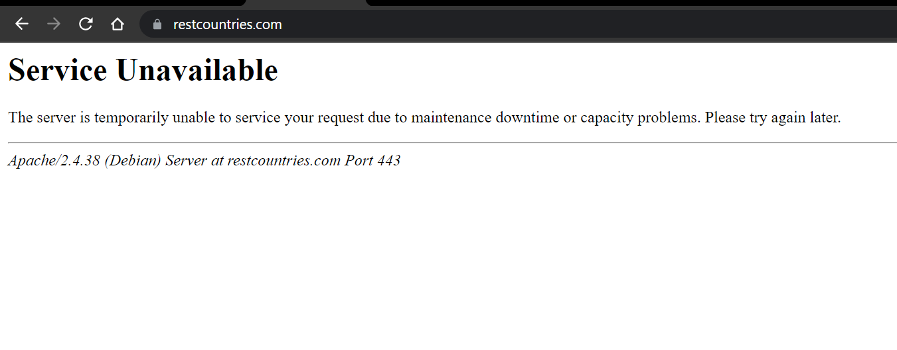

# Country Info Provider

Reference said that the application will be ran on many different platforms, so I decided to make it a web app. 

Sometimes REST API given in the task is **not working**. You can try either my test file **(test.json)(only few EU countries)** or yours.\
To do this please ...

Because of this I unfortunately couldn't test this URL for different continents.

This app has a configurator: **tsconfig.json**\
In this file you may change link to REST API or change a configuration of the main data table with countries.\
Table head and query URL are build using this configuration.