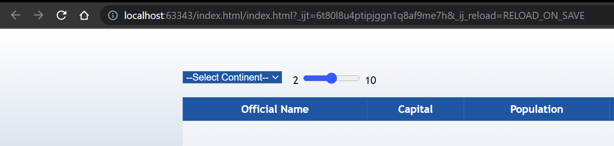

# Country Info Provider

Reference said that the application will be ran on many different platforms, so I decided to make it a web app.

Sometimes REST API given in the task is **not working**. You can try either my test file **(test.json)** (only few EU
countries)or yours.\
To do this please change a path to your file in tsconfig.json and change the place marked with comments in index.js to
fetch a local file (not a REST API response).

Because of this I unfortunately couldn't test this URL for different continents.

This app has a configurator: **tsconfig.json**\
In this file you may change link to REST API or change a configuration of the main data table with countries.\
Table header and query URL are built using this configuration file.

# Instructions

**How to pull the code / clone or fork your project repository?**\
Just pull the whole project from the GitHub repository.

**How to compile / assemble the code?**\
You don't need to compile this code.

**How to run/deploy the solution?**\
Unfortunately you **CANNOT** just double index.html for this app to work, because it will fail to load the resources.\
I am personally opening the index.html file through the project using WebStorm. Because he creates a localhost with the chosen html web
page and loads all the resources. Looks like this:

**How to use it (if any user input required)?**\
Use the select in the top left corner of the screen, to choose the continent to take countries from.\
Use the slider to choose how many random countries you want there to be shown.\
Use the button in the bottom right corner of the screen to submit get the table of countries with your chosen options.

Project is not bad bearing in mind tight deadlines. 
I hope you won't have any problems deploying it.\
If my instructions are not clear, feel free to contact me.\

Thank you for giving me this opportunity,\
Anton Reut

